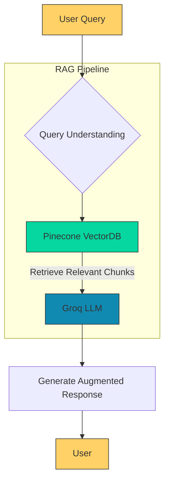

# 🧘 ZensightAI  
### *Clarity Through Conversation*  

  

> **"Your mind is a garden. Let’s tend it together."**  
> An AI companion for mindful reflection and emotional balance.  

---

## ✨ **Why ZensightAI?**  
- **Judgment-free zone** – Share freely, anytime  
- **Science-backed tools** – CBT, DBT, and mindfulness techniques  
- **Personalized insights** – Learns your emotional patterns  

---

## 🛠️ **Built With**  

### **AI Core**  
   
   

### **Frontend & Deployment**  
   

### **Development Tools**  
   

---

## 🎯 **Key Features**  

| **Feature**               | **Tech Stack**          | **Impact** |  
|---------------------------|-------------------------|------------|  
| **Contextual Responses**  | Groq LLM + Pinecone     | Low-latency, high-relevance answers |  
| **Medical Q&A**           | RAG Pipeline            | Citations from uploaded PDFs |  
| **Conversation Memory**   | Pinecone Vector Store   | Personalized follow-ups |  
| **Real-Time Processing**  | Groq LPU Inference      | 200+ tokens/sec response speed |  

### **Architecture Highlights**  
### **Architecture Diagram**


## 🌱 **Core Philosophies**  
1. **Privacy First** – All chats are encrypted  
2. **Non-Replacement** – Always suggests human help when needed  
3. **Progress Tracking** – Mood timeline visualization  

---

## 🚀 **Quick Start**  
```bash
git clone https://github.com/yourrepo/zensightai.git  
cd zensightai  
pip install -r requirements.txt  
streamlit run app/app.py  